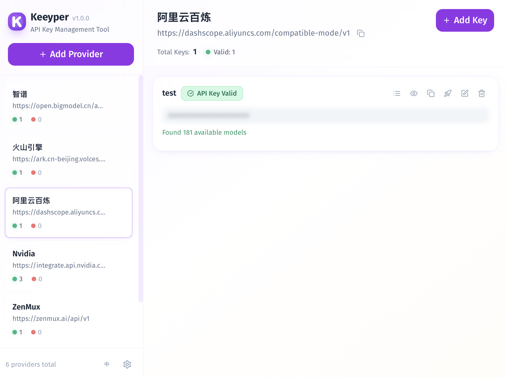
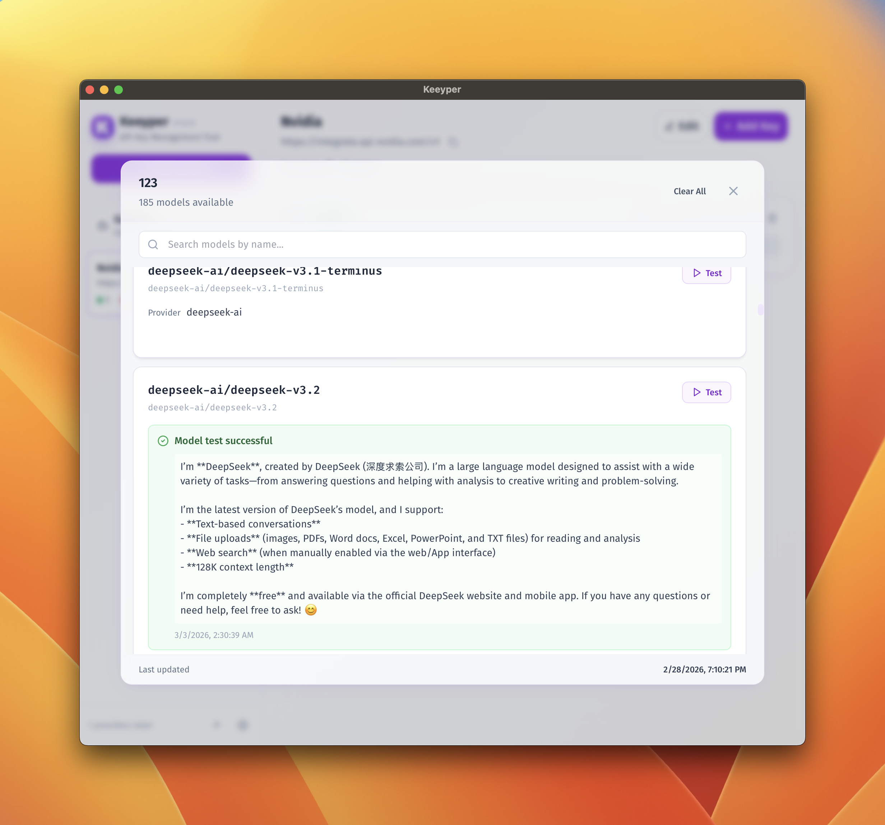

# KeyKeeper

跨平台大模型 API Key 管理工具 - 一个简单精致的桌面应用，用于管理各种 AI 提供方的 API 密钥。

> English documentation: `README.md`.

## 功能特性

- **提供方管理**: 添加、编辑、删除不同的 AI 提供方（如 OpenAI、Anthropic 等）
- **密钥管理**: 为每个提供方添加多个 API 密钥
- **过期追踪**: 为密钥设置过期时间，自动标记已过期密钥
- **快捷复制**: 一键复制提供方地址和 API 密钥
- **本地存储**: 所有数据存储在本地，不上传到云端
- **跨平台**: 支持 Windows、macOS 和 Linux
- **轻量级**: 使用 Tauri 构建，应用体积仅约 10MB

## 应用截图

以下为两个核心界面，展示日常使用的主要流程。


主界面汇总提供方与密钥状态，便于快速查看与操作。

模型列表用于查看和管理各密钥/提供方的模型可用性。

## 开发环境设置

### 前置要求

- Node.js 18+
- npm
- Rust 1.88+ (用于构建 Tauri)

#### 安装 Rust

```bash
# macOS
curl --proto '=https' --tlsv1.2 -sSf https://sh.rustup.rs | sh

# Windows
# 下载并运行 https://rustup.rs/

# Linux
curl --proto '=https' --tlsv1.2 -sSf https://sh.rustup.rs | sh
```

### 安装依赖

```bash
npm install
```

### 开发模式

```bash
# 启动 Tauri 开发模式 (会自动启动 Vite)
npm run tauri:dev
```

### 构建应用

```bash
# 构建当前平台
npm run tauri:build

# 调试构建 (更快)
npm run tauri:build:debug
```

构建产物会输出到 `src-tauri/target/release/bundle/` 目录。

## 项目结构

```
src/
  app/                 应用入口与布局
  domains/             按领域划分的功能模块
    providers/         提供方管理
    keys/              API Key 管理
    settings/          安全与设置
  shared/              共享组件与工具
  i18n/                多语言资源
  types/               全局类型定义
```

## 使用说明

### 添加提供方

1. 点击左侧边栏的「添加提供方」按钮
2. 输入提供方名称（如 "OpenAI"）
3. 输入提供方地址（如 "https://api.openai.com"）

### 添加 API 密钥

1. 选择一个提供方
2. 点击右上角的「添加密钥」按钮
3. 输入 API 密钥（必填）
4. 可选：添加名称、备注和过期时间

### 密钥状态

- 🟢 绿色：密钥有效
- 🟡 黄色：密钥即将过期（7天内）
- 🔴 红色：密钥已过期

## 技术栈

- **Tauri 2.0**: 轻量级跨平台桌面应用框架
- **React**: UI 框架
- **Vite**: 构建工具
- **Tailwind CSS**: 样式框架
- **Zustand**: 状态管理
- **TypeScript**: 类型安全
- **Rust**: 后端逻辑

## 设计风格

应用采用 Soft UI (New Soft UI) 设计风格，具有：

- 柔和的阴影和圆角
- 紫色主题配色
- 毛玻璃效果
- 平滑的过渡动画
- 优秀的可访问性

## 为什么选择 Tauri？

相比 Electron，Tauri 具有以下优势：

- **更小的体积**: 约 10MB vs Electron 的 150MB+
- **更少的内存占用**: 使用系统 WebView
- **更好的安全性**: Rust 内存安全保证
- **更快的启动速度**: 更轻量的运行时

## 许可证

MIT License，详见 `LICENSE`。

## 贡献

欢迎提交 Issue 或 PR。请先阅读 `CONTRIBUTING.md`。
